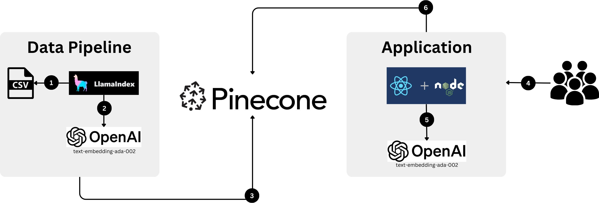
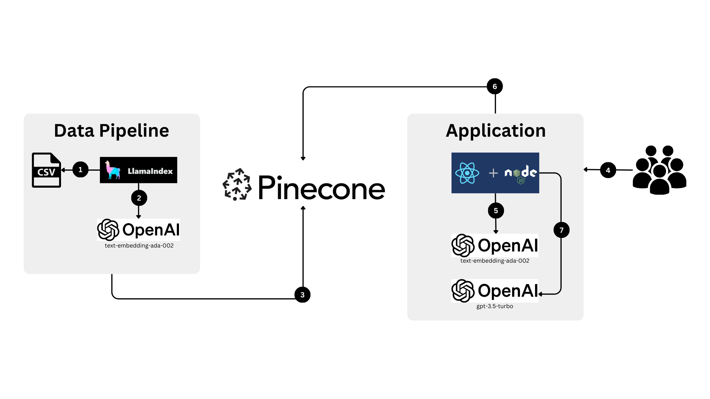
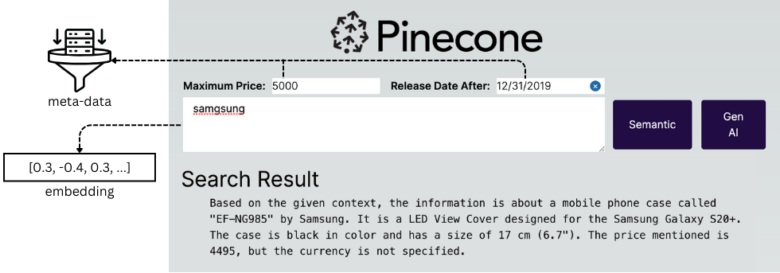

# Ecommerce Product Search
Fully functional application that demonstrates semantic search and semantic search + GenAI
with a 150K product reference dataset.

The dataset is a CSV file that has the following record format

| id | name | title | ean | short_description | img_high | img_low | img_500x500 | img_thumb | date_released | supplier | price |
| -- | ---- | ----- | --- | ----------------- | -------- | ------- | ----------- | --------- | ------------- | -------- | ----- |   
| 3920564 | 56ABCD | Some Title | ['0095205603217'] | Some Short Description | http://someurl.jpg | http://someurl.jpg | http://someurl.jpg | http://someurl.jpg | 2009-12-10T00:00:00Z | Some Supplier | 19.99 | 

The following technologies were used to build this demo

1. [Pinecone - Python Library](https://docs.pinecone.io/docs/python-client)
1. [Pinecone - Node.js Library](https://github.com/pinecone-io/pinecone-ts-client/blob/main/README.md) 
1. [LlamaIndex](https://docs.llamaindex.ai/en/stable/)
1. [Llama Hub - Paged CSV Loader](https://llamahub.ai/l/file-paged_csv)
1. [OpenAI - Python Library](https://platform.openai.com/docs/libraries/python-library)
1. [OpenAI - Node.js Library](https://platform.openai.com/docs/libraries/node-js-library)

## Overview

### Architecture - Semantic



### Architecture - GenAI



#### Data Pipeline

1. Load CSV into LlamaIndex + Generate meta-data for each record
1. Generate vector embeddings for each record
1. Persist batches of vector embeddings into Pinecone

#### Application

4. User provides search query: "Samgsung"
5. Application generates vector embedding from query
6. Application queries pinecone for most similar vectors - Semantic

7. Application asks LLM to generate a response - GenAI


## Setup
There are 2 main components 1) Data Pipeline and 2 ) Application. The data pipeline is packaged as a notebook and the Application is a next.js based React application.

### Data Pipeline

#### Prerequisites
1. [python 3.11+](https://www.python.org/downloads/) or later installed on your system. 
1. Ability to run Jupyter notebook files. [VS code](https://code.visualstudio.com/) is highly recommended. 
1. A "standard" or "enterprise" plan [Pinecone account](https://app.pinecone.io/?sessionType=signup) because this dataset exceeds the free plan limit.

#### Quickstart

1. Create a `.env` file that has the following entries

    ```
    PINECONE_API_KEY="YOUR_API_KEY"
    PINECONE_ENVIRONMENT="YOUR_ENVIRONMENT"
    PINECONE_INDEX_NAME="YOUR_INDEX_NAME"
    DIMENSIONS="1536"
    METRIC="cosine"

    OPENAI_API_KEY="YOUR_OPEN_API_KEY"
    ```

1. Run the steps in this data pipeline notebook.

    [./data-pipeline/product-search-genai.ipynb](./data-pipeline/product-search-genai.ipynb)

### Application
You must have [node.js 16.14](https://nodejs.org/) or later installed on your system.

#### Quickstart

1. Open a terminal window
1. Run: ```cd ./application```
1. Run: ```npm install```
1. Run: ```npm run dev```

## Authors
[James Williams](https://www.linkedin.com/in/james-williams-b509341/)

[Kevin Butler](https://www.linkedin.com/in/kbutler0954/)
